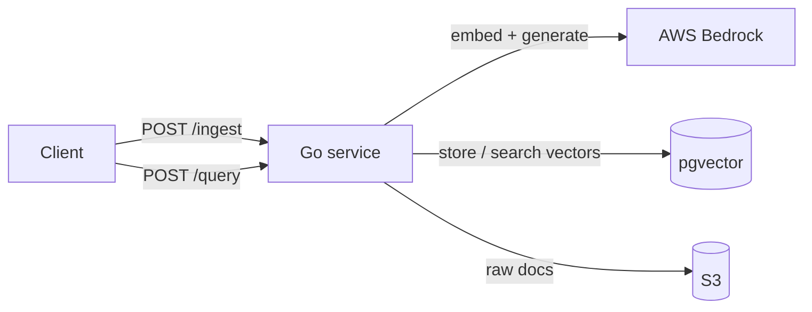
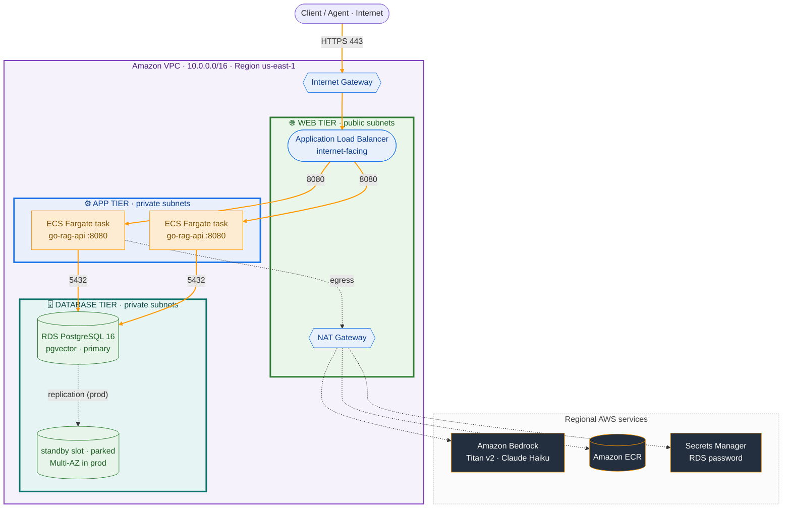

# go-rag-api

[](https://github.com/Go-Santiago-Go/go-rag-api/actions/workflows/ci.yml)
[](LICENSE)

**A production-shaped Retrieval Augmented Generation (RAG) service in Go, deployed on AWS.** It runs
the full RAG pipeline over HTTP (chunking, embedding, vector search, and grounded generation) and
answers questions with citations back to the source text: `{ answer, sources[] }`.

Retrieval uses Amazon Bedrock embeddings and pgvector similarity search, with storage and model calls
behind interfaces so the pipeline is unit tested with zero cloud access. The platform side is fully
infrastructure as code: a multi-tier VPC in Terraform, keyless CI/CD to ECR over GitHub OIDC, and a
distroless container on ECS Fargate. Built to be consumed by a human, a browser, or an agent.

Two endpoints, one service:

- `POST /ingest` makes a document searchable: chunk the text, embed each chunk with Bedrock (Titan
  v2), and persist the vectors in pgvector.
- `POST /query` answers a question: embed the question with the same model, run a cosine similarity
  search for the nearest chunks, and have a Claude model write an answer grounded in them, returned
  as `{ answer, sources[] }`.

> **Deployed:** the full service runs on AWS via ECS Express Mode. `terraform
> apply` provisions the stack and outputs a public HTTPS URL; a `/query` against it returns grounded
> `{ answer, sources[] }`, verified end to end (Bedrock embeddings + generation, pgvector in RDS).
> The stack is torn down with `terraform destroy` after each session to avoid cost, so the URL is
> regenerated per deploy rather than kept always-on.

## Architecture

The service, end to end:



A document is chunked, each chunk is embedded with Bedrock, and the vectors are stored in pgvector.
A query is embedded with the same model, the nearest chunks are retrieved by vector similarity, and
those chunks are handed to an LLM that writes an answer grounded in them, returned with the source
chunks it used.

### Deployment (AWS)

The container runs on **Amazon ECS Express Mode**: from an image plus three IAM roles, Express Mode
provisions the Fargate service, an internet-facing load balancer with TLS, autoscaling, health
checks, and the security-group wiring between the load balancer and the tasks, and hands back a
public `*.ecs.<region>.on.aws` URL. The data tier stays private: RDS Postgres has no public endpoint
and accepts connections only from the app's security group.



The orange path traces a request down the tiers: **Client → Internet Gateway → Application Load
Balancer (web tier) → ECS task (app tier) → RDS (data tier)**, each hop crossing a security group
that trusts only the tier above. The dashed lines are the app's outbound calls, which leave the
private subnets through the NAT gateway: Bedrock for embeddings and generation, ECR for the image,
and Secrets Manager for the DB password, which is injected into the container at launch (the app
assembles its connection from `PG*` env vars, so the password is never in the image or Terraform
state).

**One honest trade-off (what the diagram idealizes).** The diagram shows the intended three-tier
design. In practice, ECS Express Mode uses a single subnet set for both the load balancer and the
tasks, so you cannot keep the tasks in the private app tier while the load balancer stays public. To
get a public URL the tasks actually run in the public subnets; they have public IPs but stay
unreachable from the internet because their security group has no inbound rule except the load
balancer's. So the private app subnets and NAT gateway are provisioned but off the real request path.
Keeping tasks fully private would mean dropping to a hand-rolled `aws_ecs_service`.

Single-AZ RDS keeps this demo cheap; production would run Multi-AZ RDS and VPC endpoints for the AWS
services. Everything is torn down with `terraform destroy` after each session so nothing bills
overnight.

The `infra/` directory holds two Terraform stacks, split by lifetime:

- **`infra/bootstrap/`** provisions the free, long-lived pieces: the ECR repository and the GitHub
  OIDC CI role. Apply it once and leave it up, so CI can push images at any time and images survive
  the app stack's teardown.
- **`infra/`** provisions the billable app stack (VPC, RDS, S3, and the ECS Express service). It
  looks the ECR repository up by name, so the bootstrap stack must be applied first. This is the
  stack you destroy after each session.

```bash
# Once: the persistent stack (free: ECR repository + CI role)
cd infra/bootstrap && terraform init && terraform apply

# Each session: the billable app stack (about 10 to 15 min; RDS ~5 min, then
# Express Mode waits for health checks)
cd infra && terraform init && terraform apply
terraform output service_url   # the live public URL
terraform destroy              # tear the app stack down when done
```

Credentials come from your AWS CLI configuration. The always-on costs while up are the RDS instance,
the NAT gateway, and the Express load balancer, so a `destroy` after each session keeps the bill at
pennies. The database password is never handed to Terraform: RDS generates it and stores it in
Secrets Manager (`manage_master_user_password`), so it never lands in state.

For a step by step clone and deploy walkthrough (Bedrock model access, both stacks, pushing an image,
testing the URL, and teardown), see [DEPLOYMENT.md](DEPLOYMENT.md).

## Design decisions

Every choice below optimizes for one constraint: the simplest component that satisfies the
requirement, reaching for managed or heavyweight services only where the workload genuinely
demands them. The decisions that are not load-bearing sit behind interfaces, so they can change
later without disturbing the core.

| Decision | Choice | Why | Also considered |
|---|---|---|---|
| Vector storage | pgvector / Postgres | One datastore, standard SQL, free and reproducible locally, swappable behind an interface | OpenSearch Serverless, S3 Vectors |
| API style | REST / JSON | Consumers are a human, a browser, and one agent tool; no streaming requirement yet | gRPC |
| Service shape | Single Go service | Smallest thing that ships; no premature split into a separate ingestion service | Separate Python ingestion service |
| Query response | `{ answer, sources[] }` | Structured citations make the demo verifiable and give a downstream agent clean data to reason over | Prose-only answers |
| Text extraction | Local extraction | Free and offline; reach for a managed service only if the workload needs it | AWS Textract |
| Compute | ECS Express Mode on Fargate | Managed networking, load balancing, and scaling from a container image; App Runner is closed to new customers | Full ECS Fargate |

The pattern under all of it is **dependency inversion at the boundaries**: the RAG logic depends on
a `VectorStore` interface (plus embedder and generator interfaces), and the concrete pieces
(pgvector, Bedrock) are plugged in at `main`. That is what lets the service be tested with a fake
store and no database, and lets pgvector be swapped without touching the RAG logic.

## Status

Built local-first, then deployed to AWS. Everything below is done and verified end to end:

- [x] HTTP server with `/health`
- [x] Postgres + pgvector running locally in Docker
- [x] `VectorStore` interface with a pgvector implementation
- [x] `POST /ingest`: document chunked, embedded, and stored
- [x] `POST /query`: grounded answer with structured sources
- [x] Meaningful tests running in CI (build, vet, test)
- [x] Terraform for a three-tier VPC, private RDS, S3, and IAM
- [x] Containerized with a distroless image; CI builds and pushes to ECR via OIDC
- [x] Deployed on ECS Express Mode with a live public URL, `/ingest` and `/query` verified in the cloud

## Stack

- **Go** for the service (standard library `net/http`, no framework).
- **pgvector / Postgres** for vector storage.
- **AWS Bedrock** for embeddings (Titan v2) and answer generation (Claude).
- **S3** for raw document storage.
- **Docker** to containerize, **Terraform** for infrastructure, **GitHub Actions** for CI/CD to ECR.
- **ECS Express Mode on Fargate** to run it.

## Local development

The fastest path is local: Postgres runs in Docker and the Go service runs natively. The whole RAG
loop works on your laptop in a few commands.

**Prerequisites.** [Go 1.26+](https://go.dev/doc/install), [Docker](https://docs.docker.com/get-docker/),
and AWS credentials with **Bedrock access**. The service embeds and generates through Amazon Bedrock,
so even the local run is not fully offline: configure the AWS CLI (`aws configure`) and enable
[model access](https://docs.aws.amazon.com/bedrock/latest/userguide/model-access.html) for Titan
Text Embeddings V2 and a Claude model in your region.

```bash
# 1. Clone
git clone https://github.com/Go-Santiago-Go/go-rag-api.git
cd go-rag-api

# 2. Start Postgres + pgvector (the schema auto-applies on first boot)
docker compose up -d

# 3. Run the service. It reads AWS credentials from your environment / ~/.aws,
#    connects to the local database, and listens on :8080.
go run ./cmd/server

# 4. In another terminal: ingest a document, then ask about it.
curl -X POST localhost:8080/ingest -H 'Content-Type: application/json' \
  -d '{"document_id":"doc-1","text":"pgvector stores embeddings inside Postgres."}'

curl -s -X POST localhost:8080/query -H 'Content-Type: application/json' \
  -d '{"question":"Where does pgvector store embeddings?"}'
# { "answer": "...", "sources": [ { "content": "...", "document_id": "doc-1", "page": 0 } ] }
```

Development commands:

```bash
go build ./...   # build everything
go vet ./...     # static checks (also runs in CI)
go test ./...    # tests (also runs in CI)
```

CI runs `go build`, `go vet`, and `go test` on every push and pull request, with the Go version
sourced from `go.mod` so it lives in one place. To run the same service on AWS behind a public URL,
see [DEPLOYMENT.md](DEPLOYMENT.md).

## Endpoints

### `POST /ingest`

Makes a document searchable: chunk the text, embed each chunk with Bedrock Titan v2, and store the
vectors in pgvector. Runs synchronously and returns `201 Created` once every chunk is stored.

The service resolves its database connection in three ways, most specific first: `DATABASE_URL` if
set (local dev / `docker compose`), otherwise the standard `PG*` vars (`PGHOST`, `PGUSER`,
`PGPASSWORD`, `PGDATABASE`, `PGSSLMODE`) which pgx reads directly (this is the cloud path, where ECS
injects `PGPASSWORD` from Secrets Manager), and otherwise a local default. It also applies the schema
idempotently on startup, so a fresh RDS database becomes usable with no separate migration step. It
calls Bedrock, so the machine running it needs AWS credentials with Bedrock access and the Titan v2
model enabled in the region.

```bash
docker compose up -d      # start local Postgres + pgvector; schema auto-applies on first boot
go run ./cmd/server       # start the service on :8080

curl -i -X POST localhost:8080/ingest \
  -H 'Content-Type: application/json' \
  -d '{"document_id":"doc-1","text":"pgvector stores embeddings inside Postgres."}'
# HTTP/1.1 201 Created
```

Request body: `{ "document_id": string, "text": string }`. Both fields are required; a malformed or
incomplete body returns `400`, and a Bedrock or database failure returns `500`.

### `POST /query`

Answers a question about the ingested corpus: embed the question with the same Titan v2 model, retrieve
the nearest chunks from pgvector by vector similarity, and have a Claude model write an answer
constrained to those chunks. Returns `{ answer, sources[] }`, where each source is the chunk that
backed the answer. Generation goes through the Bedrock Converse API, so the running machine also needs
the Claude model enabled in the region (a one-time Anthropic use-case form per account gates first use).

```bash
curl -s -X POST localhost:8080/query \
  -H 'Content-Type: application/json' \
  -d '{"question":"Where does pgvector store embeddings?"}'
# { "answer": "pgvector stores embeddings inside Postgres.",
#   "sources": [ { "content": "...", "document_id": "doc-1", "page": 1 } ] }
```

Request body: `{ "question": string }`. The question is required; a malformed body or empty question
returns `400`, and a Bedrock or database failure returns `500`. The `sources[]` array is the contract
that makes an answer auditable and gives a downstream agent structured data instead of prose.

## Writeups

Build notes and explanations for the decisions behind this project are posted on LinkedIn:
[christian-santiago-dev](https://www.linkedin.com/in/christian-santiago-dev/).

## License

Released under the [MIT License](LICENSE).
