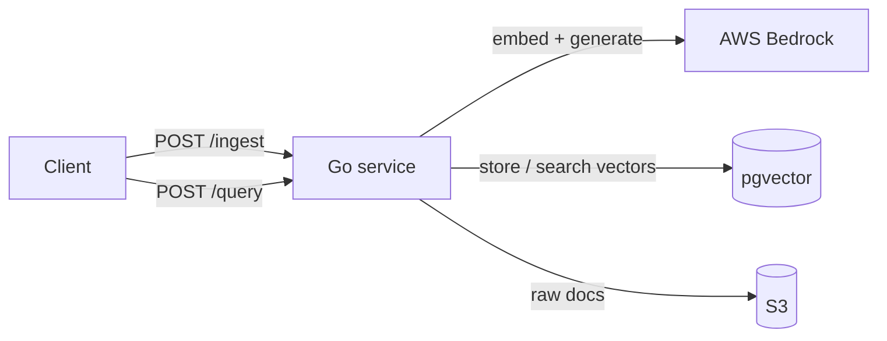

# go-rag-api

[](https://github.com/Go-Santiago-Go/go-rag-api/actions/workflows/ci.yml)

A containerized Go service that ingests documents and answers questions about them over HTTP,
returning grounded answers with structured citations. Retrieval Augmented Generation (RAG) as a
plain HTTP microservice, built to be consumed by a human, a browser, or an agent.

Two endpoints, one service:

- `POST /ingest` makes a document searchable: chunk it, embed each chunk, store the vectors.
- `POST /query` answers a question: embed it, similarity search the chunks, have an LLM write a
  cited answer, and return `{ answer, sources[] }`.

> **Live demo:** coming in Phase 8 (deployed to AWS). Until then the full loop runs locally via
> `docker compose up`. See the roadmap below for current status.

## Architecture

Target architecture (see the roadmap for what is built today):



A document is chunked, each chunk is embedded with Bedrock, and the vectors are stored in pgvector.
A query is embedded with the same model, the nearest chunks are retrieved by vector similarity, and
those chunks are handed to an LLM that writes an answer grounded in them, returned with the source
chunks it used.

## Design decisions

Every choice below optimizes for one constraint: the simplest component that satisfies the
requirement, reaching for managed or heavyweight services only where the workload genuinely
demands them. The decisions that are not load-bearing sit behind interfaces, so they can change
later without disturbing the core.

| Decision | Choice | Why | Also considered |
|---|---|---|---|
| Vector storage | pgvector / Postgres | One datastore, standard SQL, free and reproducible locally, swappable behind an interface | OpenSearch Serverless, S3 Vectors |
| API style | REST / JSON | Consumers are a human, a browser, and one agent tool; no streaming requirement yet | gRPC |
| Service shape | Single Go service | Smallest thing that ships; no premature split into a separate ingestion service | Separate Python ingestion service |
| Query response | `{ answer, sources[] }` | Structured citations make the demo verifiable and give a downstream agent clean data to reason over | Prose-only answers |
| Text extraction | Local extraction | Free and offline; reach for a managed service only if the workload needs it | AWS Textract |
| Compute | ECS Express Mode on Fargate | Managed networking, load balancing, and scaling from a container image; App Runner is closed to new customers | Full ECS Fargate |

The pattern under all of it is **dependency inversion at the boundaries**: the RAG logic depends on
a `VectorStore` interface (plus embedder and generator interfaces), and the concrete pieces
(pgvector, Bedrock) are plugged in at `main`. That is what lets the service be tested with a fake
store and no database, and lets pgvector be swapped without touching the RAG logic.

## Status & roadmap

Built local-first, then deployed to AWS. The MVP cut line is the end of Phase 6.

- [x] **Phase 0** — project scaffold, CI green
- [x] **Phase 1** — HTTP server with `/health`
- [x] **Phase 2** — Postgres + pgvector running in Docker
- [x] **Phase 3** — `VectorStore` interface + pgvector implementation
- [x] **Phase 4** — `POST /ingest`: document to stored embeddings
- [ ] **Phase 5** — `POST /query`: grounded answer with sources
- [ ] **Phase 6** — tests, full README, **MVP complete**
- [ ] **Phase 7** — Terraform for S3, RDS, and IAM
- [ ] **Phase 8** — deployed on ECS Express Mode, live URL

## Stack

- **Go** for the service (standard library `net/http`, no framework).
- **pgvector / Postgres** for vector storage.
- **AWS Bedrock** for embeddings (Titan v2) and answer generation (Claude).
- **S3** for raw document storage.
- **Docker** to containerize, **Terraform** for infrastructure, **GitHub Actions** for CI/CD to ECR.
- **ECS Express Mode on Fargate** to run it.

## Local development

```bash
go run ./cmd/server   # run the service
go build ./...         # build everything
go vet ./...           # static checks
go test ./...          # tests
```

CI runs `go build`, `go vet`, and `go test` on every push and pull request, with the Go version
sourced from `go.mod` so it lives in one place.

## Endpoints

### `POST /ingest`

Makes a document searchable: chunk the text, embed each chunk with Bedrock Titan v2, and store the
vectors in pgvector. Runs synchronously and returns `201 Created` once every chunk is stored.

The service reads its database connection from `DATABASE_URL` (defaulting to the local
`docker compose` Postgres) and calls Bedrock, so the machine running it needs AWS credentials with
Bedrock access and the Titan v2 model enabled in the region.

```bash
docker compose up -d      # start local Postgres + pgvector; schema auto-applies on first boot
go run ./cmd/server       # start the service on :8080

curl -i -X POST localhost:8080/ingest \
  -H 'Content-Type: application/json' \
  -d '{"document_id":"doc-1","text":"pgvector stores embeddings inside Postgres."}'
# HTTP/1.1 201 Created
```

Request body: `{ "document_id": string, "text": string }`. Both fields are required; a malformed or
incomplete body returns `400`, and a Bedrock or database failure returns `500`.

`POST /query` (grounded answer with sources) arrives in Phase 5.

## Writeups

Build notes and explanations published alongside this project:

- _Wiring CI before you have code to test: a Go + GitHub Actions walkthrough_ (coming soon)

More as the project progresses.
